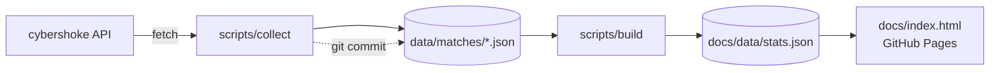

# CS2 Stata — техзадание на инструмент статистики

2026-09-17 · @Mikhail

## Цель

Заменить ручной сбор статистики после каждой игровой сессии на статический сайт, который сам тянет данные с cybershoke.net и пересчитывает две таблицы: за всё время и за последнюю сессию.

Главная находка разведки: cybershoke отдаёт не только K/D/A, а полную статистику с разбора демо — ADR, KAST, KPR, раунды, опенинги, клатчи, мультикиллы, урон утилитой. Это значит, что рейтинг можно считать по полной формуле HLTV Rating 2.0, а не по урезанной.

**Что считается успехом**

- После сессии одна команда в Claude Code обновляет сайт, руками ничего не вбивается.
- Таблица за всё время повторяет текущую ручную сводку (K, D, A, K/D) и добавляет рейтинг, число карт и винрейт.
- Отдельный блок — сводка за последнюю сессию.
- Игроки, не набравшие 30% карт от лидера по картам, серые и внизу; остальные подсвечены по рейтингу.
- Ноль платных сервисов: GitHub, GitHub Pages, GitHub Actions — всё в бесплатных лимитах.

**Что вне объёма первой версии**

Личные страницы игроков, графики формы по времени, разбор по сторонам (T/CT) и по картам. Данные для этого собираются, показ добавляется позже.

## Архитектура и стек

Один репозиторий на GitHub: сырые данные в JSON, скрипт-сборщик на Node, статическая страница на GitHub Pages. Базы данных и бэкенда нет — история живёт в git.



| Слой | Решение | Почему |
| --- | --- | --- |
| Хранилище | JSON-файлы в репо | Бесплатно, история изменений из коробки, откат одной командой |
| Сборщик | Node 20+, только `fetch` и `node:fs` | Нет зависимостей, запускается везде |
| Расчёты | Отдельный скрипт `build` | Пересчёт рейтинга без повторного похода в сеть |
| Сайт | Один `index.html` + `stats.json` | Нет сборки, нет npm-зависимостей в рантайме |
| Хостинг | GitHub Pages из папки `docs/` | Бесплатно, ссылка шарится команде |

**Структура репозитория**

```
data/matches/<id_lobby>.json   сырой ответ lobbys/info, один файл на карту
data/index.json               реестр: id, карта, время, сессия, статус разбора
data/players.json             ручные алиасы и отображаемые имена по steamid64
scripts/collect.mjs           сбор новых матчей
scripts/build.mjs             агрегация → docs/data/stats.json
docs/index.html               страница
docs/data/stats.json          всё, что читает страница
```

Разделение `collect` и `build` — принципиальное. Сырые ответы API сохраняются целиком и навсегда, чтобы любая правка формулы рейтинга пересчитывала всю историю за секунды и без запросов к cybershoke.

## Источник данных: API cybershoke

Разведано в браузере 17 сентября 2026 на живом матче `11836698`. База: `https://cybershoke.net/api/api/v1/` — `api` в пути действительно дважды, это не опечатка. Все запросы — POST с JSON-телом.

| Эндпоинт | Тело запроса | Авторизация | Что даёт |
| --- | --- | --- | --- |
| `custom-matches/lobbys/list` | `{lobby_status, only_my_matches, type_lobby:[], name_map:[], id_data_center:[], only_friends}` | нужна при `only_my_matches:true` | Список лобби: `id_lobby`, карта, счёт, хост, время |
| `custom-matches/lobbys/info` | `{id_lobby, lobby_password, players_waiting_all}` | не нужна | Полный матч со статистикой игроков |

`lobby_status`: `0` — новые, `3` — завершённые. Запрос с `only_my_matches:true` без сессионной куки возвращает `{"result":"error","code":null}` — проверено.

**Главное: `lobbys/info` открыт**

Получить полную статистику матча можно без логина, зная только `id_lobby`. Авторизация нужна ровно для одного — узнать список своих id.

**Статистика игрока** лежит в `data.match_more_stats.stats.team1.players[]` и `.team2.players[]` (источник `source: "demo"`, парсер `v5`). Реальный игрок из той выгрузки:

```json
{ "steamid64": "76561198758103775", "name": "Furry_LEng5",
  "kills": 29, "deaths": 8, "assists": 3, "plusMinus": 21, "kd": 3.63,
  "adr": 155, "kast": 83, "kastRounds": 15, "kpr": 1.61, "roundsPlayed": 18,
  "hsPercent": 93, "hsKills": 27, "mvp": 9, "impact": 3.09, "swing": 6.22,
  "rws": 40.14, "faceitRating": 1.49, "mkRounds": 10, "mkRate": 56,
  "multikills": { "k1": 4, "k2": 5, "k3": 5, "k4": 0, "k5": 0 },
  "entries": { "fk": 8, "fd": 2, "attempts": 10, "successRate": 80 },
  "clutchTotals": { "situations": 1, "won": 0, "lost": 1, "rate": 0 },
  "utility": { "flashAssists": 0, "heDamage": 0, "enemiesFlashed": 0 },
  "aim": { "accuracy": 28, "headAcc": 70, "ttk": 198 } }
```

Рядом в `stats` есть `totalRounds`, `durationSec`, `map`, `team1/team2` с `name`, `score`, `isWinner`, `startSide`, а также `rounds[]`, `halves`, `duels`, `economyTimeline`. Для BO-серий то же самое повторяется покарточно в `match_more_stats.maps["1"]`, `["2"]` и так далее.

**У данных два уровня полноты, и это главное ограничение для истории**

Разбор демо хранится не вечно. Проверено на живых матчах 17 сентября 2026:

| Матч | Дата | Счёт | `match_more_stats.stats` |
| --- | --- | --- | --- |
| `11400001` | 2 сентября 2026 | 3:13 | есть, `finished` |
| `10200000` | 24 июля 2026 | 11:13 | есть, `finished` |
| `10000000` | 16 июля 2026 | — | есть, `finished` |
| `9500000` | 26 июня 2026 | 31:12 | `null` |
| `8000001` | 25 апреля 2026 | 8:13 | `null` |

Граница лежит где-то между концом июня и серединой июля 2026 — порядка двух месяцев назад от сегодня. Матчи старше этой границы никуда не деваются и открываются, но у них `stats`, `replay` и `highlights` равны `null`.

Для таких матчей остаётся урезанный набор — ровно тот, что виден на странице матча:

```json
"players": { "76561199383003587": { "name": "YrRilo",
    "match_stats": { "live": { "kills": 10, "deaths": 18, "assists": 10, "headshots": 0 } } } }
```

Плюс `match_stats.base` со счётом — из него берётся число раундов как сумма двух счетов. Поэтому каждая карта помечается полем `statsTier`:

| `statsTier` | Что есть | Что считается |
| --- | --- | --- |
| `full` | K, D, A, ADR, KAST, раунды, опенинги, клатчи | Всё, включая рейтинг |
| `basic` | K, D, A, HS, счёт карты | Карты, K/D/A, K/D, WR. Рейтинг — нет |

Карты `basic` участвуют во всём, кроме рейтинга, и в том числе засчитываются в квалификацию. Рейтинг считается только по `full`, и в таблице рядом с ним подсказка вида «по 34 из 51 карты», если числа расходятся. Смешивать нельзя: без ADR и KAST формула даст другую шкалу, и сравнение игроков потеряет смысл.

Практический вывод: историю стоит залить как можно раньше. Всё, что сыграно за последние два месяца, сохранится с полной статой навсегда — в репозитории она уже не протухнет, что бы ни удалил cybershoke.

**Ограничения, которые вскрылись на практике**

- API быстро отвечает `Too Many Requests` — получено после двух запросов подряд. Нужна пауза 2–3 секунды между запросами и повтор с увеличением задержки.
- Ответ `lobbys/info` тяжёлый: внутри есть `match_more_stats.replay` с потиковыми треками игроков в base64. При сохранении его стоит выбрасывать: падение размера в десятки раз.
- Сайт за Cloudflare. Если обычный `fetch` из Node получит 403, резервный путь — Playwright в режиме реального браузера. Это первое, что нужно проверить на этапе 1.

**Как получить список своих матчей**

Два равноправных пути. Первый: один раз скопировать из браузера сессионные куки cybershoke в локальный `.env` (лежит в `.gitignore`, в репо не попадает) и дёргать `lobbys/list` с `only_my_matches:true`. Второй: передать ссылки или номера матчей руками — авторизация не нужна вообще, только `id_lobby` из адреса вида `cybershoke.net/match/<id>`. Куки протухают, да и играешь не всегда ты сам, так что второй путь не запасной, а полноценный. Подробности — в разделе про обновление.

## Модель данных

Единица учёта — карта, не матч. Все средние считаются по картам, порог квалификации тоже считается в картах.

**Нормализованная карта** — то, во что `build` превращает сырой ответ:

```json
{ "mapId": "11836698:1", "lobbyId": 11836698, "mapIndex": 1,
  "map": "de_mirage", "playedAt": 1789632288, "sessionId": "2026-09-16",
  "totalRounds": 18, "durationSec": 1263,
  "teams": [{ "key": "team1", "name": "team_athens", "score": 13, "isWinner": true }],
  "players": [{ "steamid64": "765...", "name": "AlexMax", "team": "team1",
      "won": true, "rounds": 18, "k": 29, "d": 8, "a": 3,
      "adr": 155, "kast": 83, "kpr": 1.61, "apr": 0.17, "dpr": 0.44,
      "hsPercent": 93, "fk": 8, "fd": 2, "mvp": 9,
      "multikills": { "k1": 4, "k2": 5, "k3": 5, "k4": 0, "k5": 0 },
      "clutchesWon": 0, "clutchSituations": 1,
      "rating": 1.87, "impact": 3.09 }] }
```

**Игроки.** Ключ всегда `steamid64`, никогда ник. Ники на cybershoke меняются — в твоём же скрине есть `๗๓๏๗｜∠∠๏`, который любой день станет чем-то другим. `data/players.json` хранит ручное отображаемое имя и историю ников по steamid64; если ручного имени нет, берётся ник из последней карты. Новый steamid64 добавляется в файл автоматически при первой встрече.

**Сессии.** Сессия — это цепочка карт, где пауза между соседними меньше 6 часов. По твоей истории это работает точно: семь карт с разрывом в час собираются в одну сессию, следующая пачка через 15 дней — в другую. Порог вынесен в константу `SESSION_GAP_HOURS`. Id сессии — дата её первой карты в таймзоне Europe/Samara; при двух сессиях за день добавляется суффикс `-2`.

**Только свои матчи.** В `data/config.json` лежит `coreSteamIds` — список вашей компании. Карта берётся в статистику, если в ней участвовало не менее трёх из этого списка. Защищает от случайных публичных лобби и от того, что чья-то одиночная игра с незнакомцами попадёт в общую таблицу.

## Рейтинг игрока

Как это устроено в мире. [HLTV Rating 2.0](https://www.hltv.org/news/20695/introducing-rating-20) — фактический стандарт. Он складывается из пяти компонентов на каждую сторону: фраги, выживаемость, KAST, импакт и урон. Средний игрок = 1.00. В [Rating 2.1](https://www.hltv.org/news/40051/introducing-rating-21) уточнили веса, а [Rating 3.0](https://escorenews.com/en/csgo/article/71475-how-hltv-rating-3-0-formula-actually-works-round-swing-and-eco-adjustment-explained) добавил поправки на экономику и round swing — бонус за фраги из невыгодной позиции и штраф за фарм на эко.

Мы берём 2.0. Он публично восстановлен регрессией, и все входы у нас есть:

```
Rating = 0.00738764·KAST + 0.35912389·KPR − 0.5329508·DPR
       + 0.2372603·Impact + 0.0032397·ADR + 0.15872723

Impact = 2.13·KPR + 0.42·APR − 0.41
```

Здесь KAST в процентах (83, не 0.83), KPR/DPR/APR — фраги, смерти и ассисты за раунд, ADR — урон за раунд. Коэффициенты из [разбора flashed.gg](https://dave.xn--tckwe/posts/reverse-engineering-hltv-rating/).

**Где берём входы**

| Вход | Источник |
| --- | --- |
| KAST | `player.kast` напрямую |
| ADR | `player.adr` напрямую |
| KPR | `kills / roundsPlayed` (сверить с `player.kpr`) |
| DPR | `deaths / roundsPlayed` |
| APR | `assists / roundsPlayed` |
| Impact | считаем по формуле, не берём `player.impact` |

`player.impact` у cybershoke имеет другую шкалу — в примере 3.09 при KPR 1.61. Подставить его в формулу напрямую нельзя, рейтинг раздует.

**Агрегация по многим картам.** Рейтинг за период считается не как среднее рейтингов карт, а из суммарных величин: `KPR = Σkills / Σrounds`, `KAST = ΣkastRounds / Σrounds`, `ADR = Σ(adr·rounds) / Σrounds`. Иначе короткая карта 13:2 весит столько же, сколько затяжная с овертаймами.

**Калибровка под ваш уровень.** Формула настроена на про-матчи, где 1.00 — средний профи. В вашей компании средний может выйти 0.85 или 1.15, и вся цветовая шкала съедет. Поэтому `build` считает две величины:

1. `rating` — абсолютный HLTV-подобный, сравнимый с внешним миром.
2. `ratingRel` — `rating / средний по лиге`, где средний взвешен по раундам по всем картам всех игроков. Именно по нему красятся строки.

На странице показывается `rating`, а цвет берётся от `ratingRel` — так и число честное, и цвета распределены по вашей компании.

**Сопутствующие метрики** — считать и хранить сразу, показывать по клику на строку: ADR, KAST, KPR, HS%, opening kills и deaths, мультикиллы 3K+, клатчи, MVP, винрейт.

## Правила таблицы: квалификация, цвет, порядок

Порог квалификации плавающий — 30% от числа карт самого играющего человека, а не фиксированное число.

```
maxMaps     = max(mapsPlayed) по всем игрокам за всю историю
threshold   = max(qualifyMinMaps, ceil(qualifyShare × maxMaps))
isQualified = mapsPlayed >= threshold
```

Порог пересчитывается при каждом `build` и нигде не запоминается — квалификация всегда вычисляется заново от текущих данных. Из этого само собой вытекает обратный ход: игрок, давно бывший в основном рейтинге, уходит вниз и сереет, как только лидер оторвётся настолько, что порог перегонит его число карт. Вернётся он так же автоматически, как только доберёт карт.

| Константа | По умолчанию | Зачем |
| --- | --- | --- |
| `qualifyShare` | `0.30` | Доля от карт лидера |
| `qualifyMinMaps` | `5` | Нижняя граница на старте: пока лидер не набрал 17 карт, 30% дают порог в 2–5 карт и квалифицированы все. Ставится в `0`, если это не мешает |

Порог считается один раз по таблице «за всё время» и применяется к обоим блокам. В сводке за сессию никто не выносится вниз — там всего 5–7 карт у всех — но неквалифицированные помечены значком у имени.

**Сортировка** в два ключа: `(isQualified desc, выбранная колонка desc)`. Неквалифицированные всегда ниже, но между собой упорядочены по тому же правилу.

**Цвета**

| Состояние | Условие | Цвет |
| --- | --- | --- |
| Не квалифицирован | `mapsPlayed < threshold` | серый, текст приглушён |
| Сильно | `ratingRel ≥ 1.08` | зелёный |
| Норма | `ratingRel 0.92 – 1.08` | жёлтый |
| Слабо | `ratingRel < 0.92` | красный |

Решено: цвет считается по внутренней шкале (`ratingRel`), не по абсолютной про-шкале. Зелёный значит «выше среднего в нашей компании», а не «уровень профи». Само число в колонке остаётся абсолютным — его можно сравнивать с HLTV.

Пороги 0.92 и 1.08 — стартовые и лежат в `data/config.json`. Если после первого расчёта почти все окажутся жёлтыми, таблица ничего не говорит — тогда `colorMode: "quartile"` красит верхнюю четверть зелёным, нижнюю красным, остальных жёлтым.

**Детали подачи**

- Рядом с рейтингом всегда стоит число — цвет никогда не единственный носитель смысла.
- У неквалифицированных в колонке карт пометка вида `9 / 15` — сколько есть и сколько нужно сейчас.
- Граница между группами — тонкая линия с подписью «менее 30% карт лидера (15)», где в скобках текущий порог.
- Если порог вырос с прошлого `build` и кто-то из-за этого выпал — строка в шапке вида «порог вырос до 15 карт, вне рейтинга: msn». Иначе человек посереет ни с того ни с сего и это будет выглядеть как баг.

## Интерфейс

Одна страница, два блока, переключатель вверху: **За всё время** / **Последняя сессия**. Тёмная тема по умолчанию — под привычный cybershoke.

**Колонки всегда видны**

| Колонка | Содержание |
| --- | --- |
| Игрок | Аватар + имя, ссылка на профиль Steam |
| Карт | Число карт, у неквалифицированных в формате `9 / 15` |
| K / D / A | Суммы за период |
| K/D | Два знака |
| WR | Процент побед по картам, второй строкой `W-L` |
| Рейтинг | `rating`, два знака, фон по цветовой шкале |

Эти семь скрыть нельзя — это скелет таблицы.

**Опциональные колонки** — включаются галочками в меню «Колонки» над таблицей, сгруппированы по смыслу:

| Группа | Колонки |
| --- | --- |
| Урон | ADR, HS% |
| Стабильность | KAST, KPR, DPR |
| Размены | Opening kills, opening deaths, успешность опенингов |
| Импакт | 3K+, клатчи (выиграно / ситуаций), MVP |
| Сессия | Δ к личному среднему рейтингу (только во втором блоке) |

Выбор колонок сохраняется в `localStorage` и переживает перезагрузку. Чтение и запись обёрнуты в try/catch: если хранилище недоступно, страница просто открывается с набором по умолчанию. В адресе дублируется `?cols=adr,kast,fk` — так можно кинуть ссылку сразу с нужной раскладкой.

Клик по строке раскрывает все метрики сразу, независимо от выбранных колонок, плюс разбивку рейтинга по картам. В `stats.json` лежат все показатели всегда — фильтрация чисто клиентская, без повторной загрузки.

**Блок последней сессии** — та же таблица плюс шапка: дата, список карт со счётами и ссылками на cybershoke, сколько карт и сколько часов играли. И одна дополнительная колонка — **Δ** к личному среднему рейтингу за всё время: сразу видно, кто сыграл выше себя, а кто провалился. Это то, чего в ручной таблице нет, и ради чего второй блок вообще стоит делать.

**Поведение**

- Сортировка кликом по любому заголовку; правило «неквалифицированные внизу» сохраняется при любой сортировке.
- Фильтр по карте и по диапазону сессий — вторым этапом, не в MVP.
- Телефон: таблица сворачивается до Игрок / Рейтинг / K-D-A, остальное по раскрытию строки. Горизонтального скролла быть не должно.
- Внизу — время последнего обновления и число учтённых карт.

## Процесс обновления

Два равноправных режима сбора, оба нужны в MVP. Обычный сценарий — стянуть свою историю под твоим аккаунтом. Запасной — ты не играл, ребята скинули ссылки, ты вносишь их руками.

```bash
npm run update                 # свои матчи: collect → build → commit → push
npm run add -- <ссылки или id>  # ручная дозагрузка, дальше то же самое
```

**Режим 1: свои матчи.** `collect` идёт в `lobbys/list` с `only_my_matches: true` и куками из `.env`, берёт все завершённые лобби, которых нет в `data/matches/`, и тянет по ним `lobbys/info`. Если куки протухли — внятная ошибка с напоминанием, где их взять, а не молчаливый пустой результат.

**Как достать куки — пошагово**

Нужно сделать один раз, потом повторять раз в несколько недель, когда сборщик скажет, что куки протухли. Важное: сессионная кука помечена HttpOnly, то есть через консоль её не видно. Только через вкладку Network.

1. Открой Chrome, зайди на `cybershoke.net` и убедись, что ты залогинен — в правом верхнем углу твой ник, а не кнопка входа через Steam.
2. Нажми `F12` (на Mac — `⌥⌘I`). Справа или снизу откроется панель разработчика.
3. Перейди на вкладку **Network**. Если её не видно — она под стрелочкой `»` среди остальных.
4. Не закрывая панель, обнови страницу (`F5`). Список заполнится строками.
5. В поле фильтра над списком набери `api/v2/main/data` и кликни по единственной оставшейся строке.
6. Кликни по ней **правой кнопкой** → **Copy** → **Copy as cURL**. В буфере окажется длинная команда — это нормально.
7. Вставь её в Claude Code со словами: «вот мой запрос, вытащи оттуда куки и положи в `.env`».

Альтернатива без вставки в чат: на шаге 6 вместо Copy as cURL открой вкладку **Headers** справа, найди раздел **Request Headers** и в нём строку `cookie:`. Скопируй всё, что после двоеточия, и впиши в файл `.env` в корне проекта одной строкой:

```
CYBERSHOKE_COOKIE="сюда всё скопированное"
```

Две вещи, которые важно понимать. Первое: эта строка — ключ от твоего аккаунта на cybershoke. Никому её не пересылай и не коммить в git — `.env` должен быть в `.gitignore` с первого дня. Второе: если случайно зальёшь её в репозиторий или покажешь на скрине — просто выйди из аккаунта на cybershoke и зайди заново, старая кука сразу станет бесполезной.

Если всё это кажется лишней вознёй — режим 2 ничего из этого не требует вообще. Можно жить только на нём и кидать ссылки руками после каждой сессии.

**Режим 2: ручная дозагрузка.** Авторизация не нужна вообще — `lobbys/info` открыт. Аргументы принимаются в любом виде и в любой смеси:

```
npm run add -- https://cybershoke.net/match/11836698
npm run add -- https://cybershoke.net/de/match/11836698 11836879
npm run add -- 11836698,11836879
npm run add -- --file links.txt      # по одной строке на матч
```

Парсинг одной регуляркой: вытащить последнее число из 7+ цифр. Локаль в ссылке (`/de/`, `/ru/`) игнорируется. Что печатается в конце: сколько добавлено, сколько уже было, сколько ушло в `pending`, и отдельно — что не распозналось.

Две проверки на ручном вводе, потому что чужую ссылку легко вставить по ошибке:

1. Формат матча — 5x5. Иначе отказ с пояснением.
2. В матче не менее трёх игроков из `coreSteamIds`. Не прошло — вопрос в консоли со списком имён и флаг `--force`, чтобы всё равно добавить.

Новый игрок из такого матча попадает в `players.json` и в таблицу автоматически — с одной картой он всё равно будет серым и внизу.

**Заливка старой истории.** Отдельного режима не нужно — это тот же `npm run add`, просто со списком побольше. Собрать ссылки в `links.txt` по одной на строку и запустить `npm run add -- --file links.txt`. На сотне матчей это порядка пяти минут из-за троттлинга — запустил и пошёл делать свои дела.

Сборщик должен выдерживать длинный список: писать прогресс по ходу (`47 / 120`), сохранять каждый матч сразу после скачивания, а не в конце, и продолжать с места обрыва при повторном запуске. Упавший на сотом матче скрипт не должен терять первые девяносто девять.

Где взять ссылки на старые игры: страница `cybershoke.net/matches/history` под своим аккаунтом — либо режимом 1, либо руками через копирование ссылок. Кого-то из ребят можно попросить скинуть свою историю — матчи общие, дубли отсеются сами по `id_lobby`.

**Идемпотентность.** `collect` скачивает только те `id_lobby`, которых нет в `data/matches/`. Два запуска подряд не меняют ничего. Применяются два фильтра: `status_match` говорит, что матч завершён, и `match_more_stats.stats` непустой. Недоигранные и отменённые лобби не сохраняются.

**Разбор демо запаздывает.** Сразу после матча `match_more_stats.stats` может быть пустым или со `status` не `finished` — демка ещё обрабатывается. Такие id записываются в `data/pending.json` и добираются при следующем запуске. Без этого карта молча потеряется навсегда.

**Сетевая аккуратность.** Один запрос в 2–3 секунды, при 429 или `Too Many Requests` — пауза с удвоением до 60 секунд, максимум 5 попыток. На 5–7 карт это полминуты — торопиться некуда.

**Два защитных правила**

1. `collect` никогда не удаляет и не перезаписывает файлы в `data/matches/` — только добавляет. Перезапись только по явному `--refetch`.
2. `build` полностью пересобирает `stats.json` из сырых файлов и никогда не читает предыдущий `stats.json`. Иначе одна ошибка в агрегации накапливается и её не открутить.

Про автозапуск по расписанию через GitHub Actions: технически возможен, но требует положить сессионные куки в GitHub Secrets, а они протухают. В первой версии — только ручной запуск с локальной машины.

## План реализации

Пять этапов, каждый заканчивается проверяемым результатом. Первый — самый важный: он проверяет главное допущение всего проекта.

> **Прямая инструкция для Claude Code.** Реализуй этапы строго по очереди и **останавливайся после каждого**, пока человек не подтвердит приёмку. Не забегай вперёд и не делай два этапа за раз.
>
> Особенно важен этап 1: он проверяет допущение, на котором держится весь проект. Если он провалился — не придумывай обходные пути сам, остановись и скажи об этом.
>
> **Когда остановиться и спросить человека:**
>
> - Этап 1 дал 403, капчу или редирект от Cloudflare.
> - `lobbys/list` отдаёт меньше матчей, чем видно в браузере на странице истории.
> - Формат ответа не совпадает с описанным в разделе про API — поля переименованы или пропали.
> - Суммы K/D/A на этапе 3 не сошлись с ручной таблицей.
> - Средний `ratingRel` вышел не равен 1.00 — ошибка в агрегации, не подгоняй коэффициенты.
>
> Человек не технический — объясняй проблему без жаргона и давай готовые варианты на выбор, а не открытый вопрос.

1. **Разведка боем.** Минимальный скрипт: `fetch` на `lobbys/info` с `id_lobby: 11836698` из Node.
   - Приёмка: в консоли есть `kills`, `adr`, `kast` для 10 игроков.
   - Если 403 от Cloudflare — перейти на Playwright и сразу сказать об этом, остальное не меняется.
2. **Сборщик.** `collect.mjs` в обоих режимах — свои матчи по кукам и ручная дозагрузка —, троттлингом, `pending.json` и выбрасыванием `replay`.
   - Приёмка: собраны все семь карт последней сессии; повторный запуск даёт пустой `git status`.
3. **Агрегация и рейтинг.** `build.mjs`: нормализация, сессии, формула, `ratingRel`.
   - Приёмка: суммы K/D/A по игрокам совпадают с ручной таблицей за тот же период до единицы.
   - Приёмка: средний `ratingRel` по всем игрокам равен 1.00 ± 0.01.
4. **Страница.** `docs/index.html`: два блока, цвета, сортировка, раскрытие строки.
   - Приёмка: неквалифицированные серые и внизу при любой сортировке; на ширине 375px нет горизонтального скролла.
5. **Публикация.** GitHub Pages из `docs/`, `npm run update` одной командой, README с памяткой про куки.
   - Приёмка: сайт открывается по публичной ссылке и показывает актуальные данные.

**Что должно быть покрыто тестами** (`node --test`, без фреймворков): формула рейтинга на эталонном игроке, разбиение на сессии на синтетических метках времени, агрегация по взвешенным раундам, плавающий порог квалификации (включая случай, когда игрок выпадает из-за роста лидера), парсинг ссылок и номеров матчей, порядок сортировки.

**Как отдать это в Claude Code.** Сохрани этот документ в репо как `SPEC.md` и напиши: «Реализуй этап 1 из SPEC.md и остановись». Этап 1 решает, нужен ли Playwright, и это единственный вопрос, который может перекроить план.

## Риски и открытые вопросы

| Риск | Вероятность | Что делать |
| --- | --- | --- |
| Cloudflare блокирует запросы из Node | средняя | Playwright с реальным браузером; проверить на этапе 1 |
| Куки протухают, `only_my_matches` ломается | высокая | Режим `--ids` работает без авторизации вообще |
| API меняет формат полей | средняя | Сырые ответы хранятся целиком — старая история не пропадёт, правится только `build` |
| Демка не распарсилась, статы нет | низкая | `pending.json` и добор при следующем запуске |
| Репо растёт от JSON | низкая | Без `replay` файл карты — десятки килобайт; 500 карт — около 20 МБ |

**Открытые вопросы**

- Цветовые пороги 0.92 / 1.08 — догадка. Окончательно настраиваем после первого реального расчёта.
- Глубина истории: `lobbys/list` может отдавать только последние N матчей. Старую историю придётся добирать режимом `--ids`. Проверить на этапе 2.
- Заливка истории — это тот же `npm run add`, отдельного режима не нужно. Но чем старше матч, тем выше шанс, что он придёт с `statsTier: "basic"` и без рейтинга.

## Источники

- [Introducing Rating 2.0 — HLTV](https://www.hltv.org/news/20695/introducing-rating-20)
- [Introducing rating 2.1 — HLTV](https://www.hltv.org/news/40051/introducing-rating-21)
- [Reverse Engineering the HLTV 2.0 Rating](https://dave.xn--tckwe/posts/reverse-engineering-hltv-rating/) — коэффициенты регрессии
- [How HLTV Rating 3.0 formula actually works — Escorenews](https://escorenews.com/en/csgo/article/71475-how-hltv-rating-3-0-formula-actually-works-round-swing-and-eco-adjustment-explained)
- Разведка API: живые ответы cybershoke.net, матч [11836698](https://cybershoke.net/match/11836698), 17 сентября 2026
